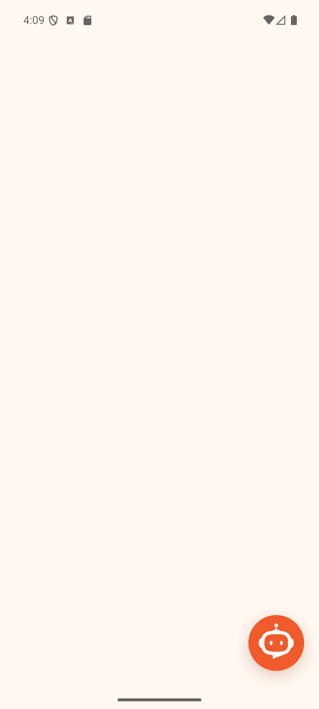
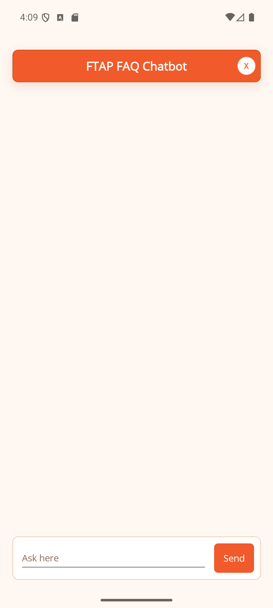
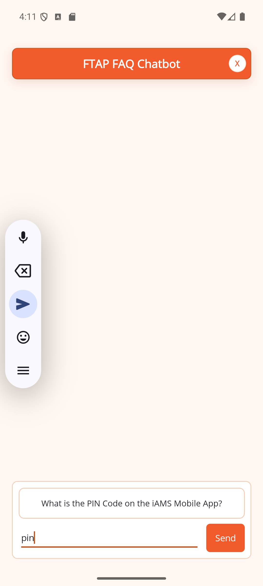
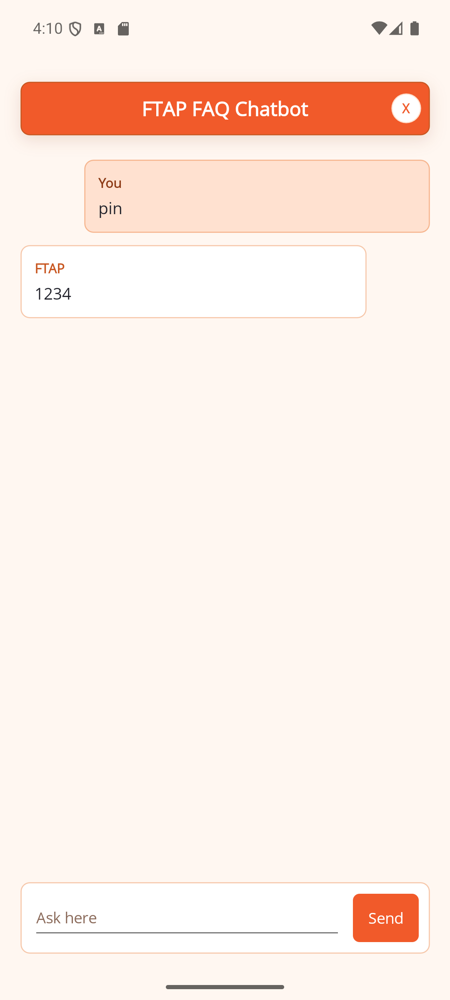
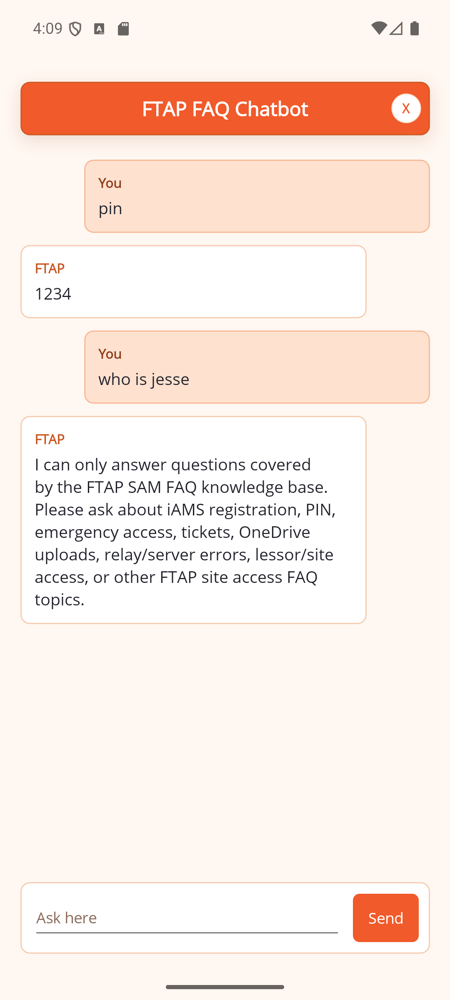

# FTAP AI Chatbot PoC

Mobile chatbot proof of concept for FTAP site-access support. The app is built with .NET MAUI and calls an n8n Cloud webhook. n8n uses the extracted FTAP SAM FAQ PDF as the knowledge base and routes each request through an OpenAI-backed n8n AI Agent, while the final answer text is returned exactly from the matched PDF FAQ entry.

Design direction is based on the Frontier Towers Philippines brand presence: tower identity, restrained work-tool layout, and an orange-led palette inspired by [frontiertowersphilippines.com](https://frontiertowersphilippines.com/).

## Live Endpoint

```text
n8n workflow: FTAP AI Chatbot
workflow id:  kzStLZqZgHyFBbPR
webhook:      https://raymondneil.app.n8n.cloud/webhook/ftap-faq-chat
```

## What Is Included

```text
n8n-ftap-faq-chatbot-poc/
  data/
    faq-knowledge.json
    faq-knowledge.md
  docs/
    TECHNICAL_ARCHITECTURE.md
  maui/
    Reusable MAUI client/page sample
  mobile/
    FtapFaqChatbot.Mobile/
      .NET MAUI Android app
  tests/
    call-webhook.ps1
    sample-question.json
    test-live-webhook.ps1
  tools/
    build-workflow.mjs
  workflows/
    ftap-faq-chatbot.n8n.json
```

## Key Behavior

- App title is `FTAP AI Chatbot`.
- Chat modal title is `FTAP FAQ Chatbot`.
- The app starts on a blank home page with a lower-right bot-icon floating action button that opens the chatbot as a full-page modal.
- The UI uses one orange-led palette, a clean title header, input-attached FAQ suggestions, and distinct user and FTAP message colors.
- The chatbot answers from `data/faq-knowledge.json`, extracted from `3. FTAP SAM System FAQs. 2025 (GLOBE).pdf`.
- n8n/OpenAI can classify or ground the request, but the final `answer` field is the exact matched answer from the PDF-derived knowledge base.
- If the question is not covered by the FAQ knowledge base, the app and workflow return a generic FAQ-scope fallback instead of forcing a weak FAQ match.

## Screenshots

| Scenario | Screenshot |
| --- | --- |
| Blank host page with only the orange chatbot FAB |  |
| Full-page FTAP FAQ Chatbot modal with compact close button |  |
| FAQ autocomplete suggestion while typing |  |
| Exact FAQ answer returned from the PDF knowledge base |  |
| Edge case: unrelated question returns FAQ-scope fallback |  |
| Closing the modal returns to the blank host page |  |

## API Contract

Request:

```json
{
  "message": "What is the iAMS PIN code?",
  "sessionId": "demo-1"
}
```

Response:

```json
{
  "sessionId": "demo-1",
  "answer": "1234",
  "confidence": 0.98,
  "source": "n8n-openai-agent-pdf-kb-exact",
  "sourceDocument": "3. FTAP SAM System FAQs. 2025 (GLOBE).pdf",
  "effectiveDate": "January 2026",
  "matchedFaq": {
    "number": 2,
    "question": "What is the PIN Code on the iAMS Mobile App?",
    "score": 20
  },
  "openAi": {
    "used": true,
    "model": "gpt-5-mini",
    "mode": "agent-routed-exact-pdf-answer"
  }
}
```

## Test The Live Webhook

```powershell
.\tests\call-webhook.ps1 `
  -WebhookUrl "https://raymondneil.app.n8n.cloud/webhook/ftap-faq-chat" `
  -Message "What is the iAMS PIN code?"
```

Expected answer:

```text
1234
```

To verify every extracted FAQ entry returns the exact stored answer:

```powershell
.\tests\test-live-webhook.ps1
```

The same script also verifies that an unrelated prompt returns the generic FAQ-scope fallback instead of a weak FAQ match.

## Reuse In Another MAUI App

To reuse only the lower-right FAB and the full-page FTAP FAQ Chatbot modal in another .NET MAUI app:

1. Copy these files into the target MAUI project:

```text
mobile/FtapFaqChatbot.Mobile/FtapFaqChatClient.cs
mobile/FtapFaqChatbot.Mobile/MainPage.xaml
mobile/FtapFaqChatbot.Mobile/MainPage.xaml.cs
mobile/FtapFaqChatbot.Mobile/Resources/Images/chatbot_fab.png
```

2. Rename `MainPage` if your app already has one, for example to `FtapFaqChatbotModal`, and update `x:Class` plus the code-behind class name.
3. Keep this MAUI image include in the target `.csproj` if it is not already present:

```xml
<MauiImage Include="Resources\Images\*" />
```

4. Add the FAB to the host page layout:

```xml
<ImageButton
    WidthRequest="74"
    HeightRequest="74"
    Margin="0,0,18,24"
    Padding="0"
    Aspect="AspectFit"
    BackgroundColor="Transparent"
    Clicked="OnChatFabClicked"
    CornerRadius="38"
    HorizontalOptions="End"
    Source="chatbot_fab.png"
    VerticalOptions="End" />
```

5. Open the chatbot as a full-page modal:

```csharp
private async void OnChatFabClicked(object? sender, EventArgs e)
{
    await Navigation.PushModalAsync(new FtapFaqChatbotModal());
}
```

6. Confirm Android internet permission is present:

```xml
<uses-permission android:name="android.permission.INTERNET" />
```

The reusable modal calls `https://raymondneil.app.n8n.cloud/webhook/ftap-faq-chat` through `FtapFaqChatClient`. Change `WebhookUri` in that file if the target app should call a different n8n workflow.

## Build The MAUI App

From `mobile/FtapFaqChatbot.Mobile`:

```powershell
$env:ANDROID_SDK_ROOT = "C:\Program Files (x86)\Android\android-sdk"
$env:ANDROID_HOME = $env:ANDROID_SDK_ROOT

dotnet build .\FtapFaqChatbot.Mobile.csproj `
  -f net10.0-android `
  -c Debug `
  -p:AndroidSdkDirectory="$env:ANDROID_SDK_ROOT" `
  -nr:false
```

## Run On Android Emulator

```powershell
$adb = "C:\Program Files (x86)\Android\android-sdk\platform-tools\adb.exe"
$package = "com.frontiertowers.ftapfaqchatbot"
$activity = "crc6469d25d5cf5a6bc93.MainActivity"
$apk = "bin\Debug\net10.0-android\com.frontiertowers.ftapfaqchatbot-Signed.apk"

& $adb devices
& $adb install --no-incremental -r -d $apk
& $adb shell pm clear $package
& $adb shell am start -W -n "$package/$activity"
```

## APK Artifact

The latest debug APK checked into the repository is:

```text
artifacts/FTAP-AI-Chatbot-debug.apk
```

## Rebuild Local n8n Workflow JSON

The local workflow export can be regenerated from `data/faq-knowledge.json`:

```powershell
node .\tools\build-workflow.mjs
```

For local OpenAI route metadata, configure:

```powershell
Copy-Item .env.example .env
```

Then set `OPENAI_API_KEY` in your n8n environment or credential store. Do not commit real API keys.

## Documentation

See [docs/TECHNICAL_ARCHITECTURE.md](docs/TECHNICAL_ARCHITECTURE.md) for architecture diagrams, workflow behavior, data contracts, security notes, and verification steps.
