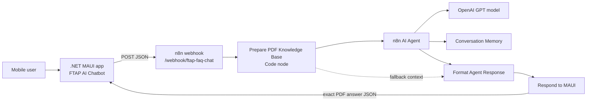
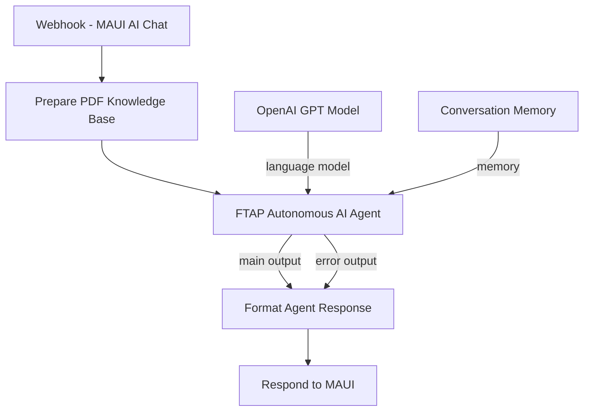
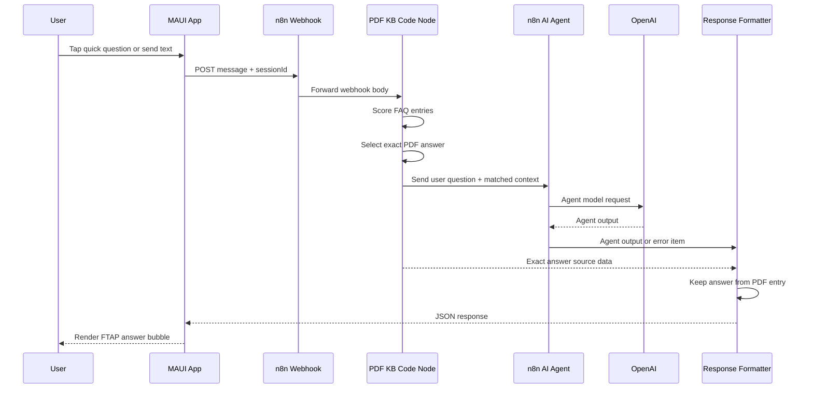
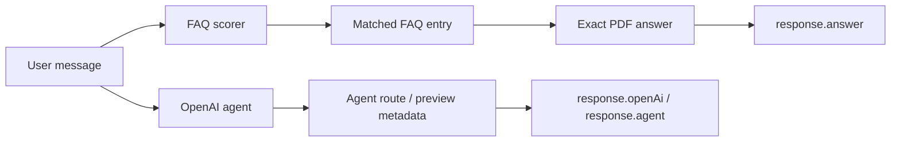
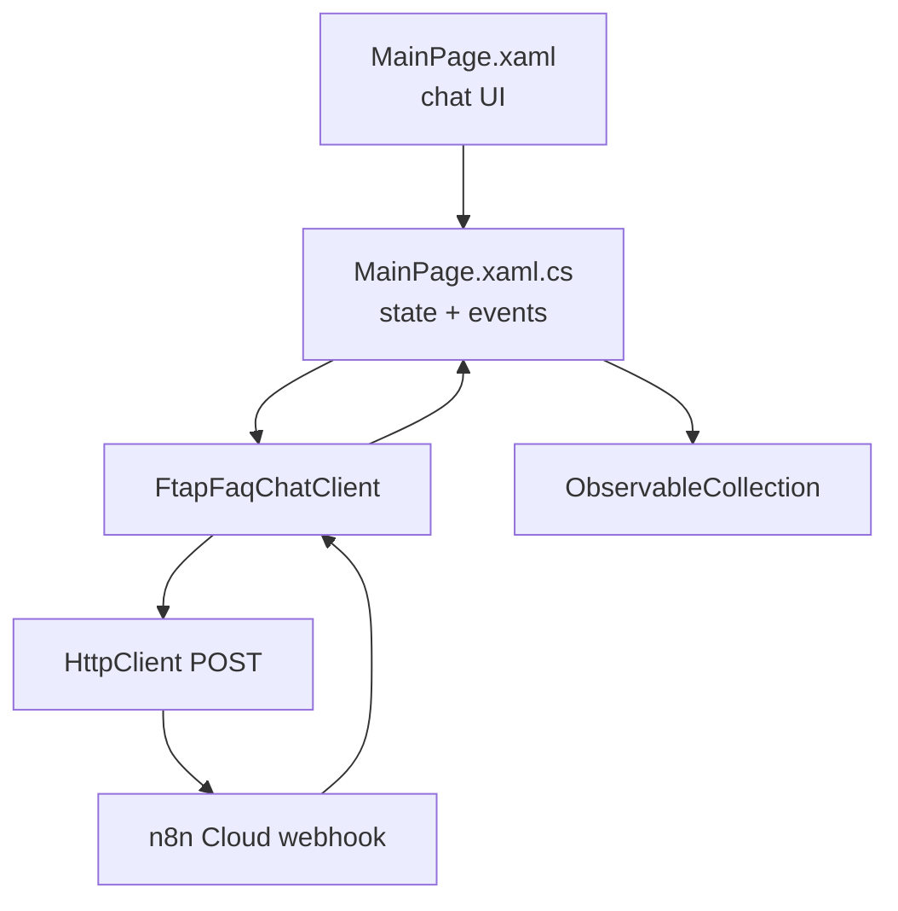
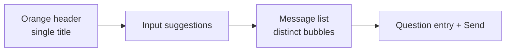
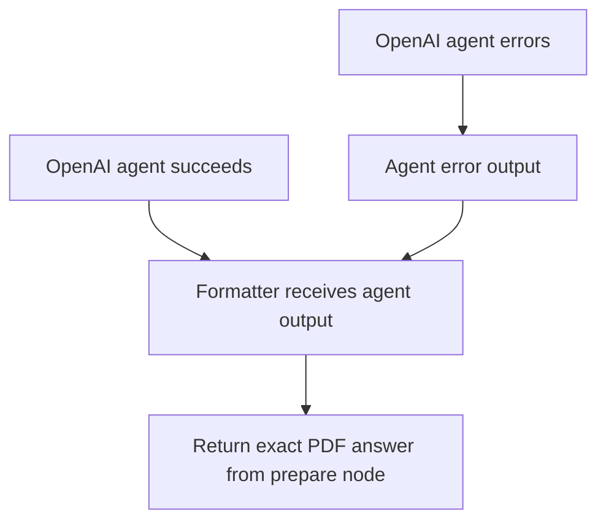
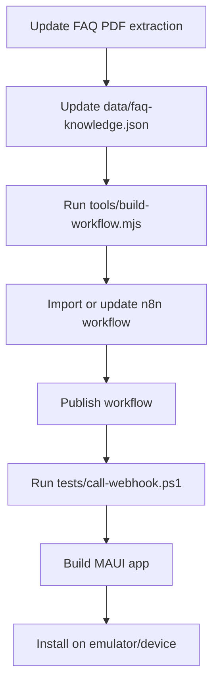

# FTAP AI Chatbot Technical Architecture

## Objective

Build a testable mobile chatbot PoC where a .NET MAUI app calls n8n, n8n uses OpenAI agent capability and the FTAP SAM FAQ PDF-derived knowledge base, and the final user-facing answer stays exactly aligned to the PDF.

The core rule is strict:

```text
The OpenAI agent can assist with routing and grounding, but the response.answer field must be copied from the matched PDF FAQ entry.
```

## Runtime Architecture



## Repository Structure

```text
data/
  faq-knowledge.json       Canonical extracted FAQ knowledge base.
  faq-knowledge.md         Human-readable version of the FAQ knowledge base.
docs/
  TECHNICAL_ARCHITECTURE.md
maui/
  Reusable client/page sample for embedding in another MAUI app.
mobile/FtapFaqChatbot.Mobile/
  Full .NET MAUI Android app used for emulator testing.
tests/
  call-webhook.ps1         PowerShell smoke test for n8n webhook.
tools/
  build-workflow.mjs       Regenerates local n8n workflow JSON from data.
workflows/
  ftap-faq-chatbot.n8n.json
```

## Live n8n Workflow

```text
Name:        FTAP AI Chatbot
Workflow ID: kzStLZqZgHyFBbPR
Webhook:     https://raymondneil.app.n8n.cloud/webhook/ftap-faq-chat
```

The production workflow is active in n8n Cloud. It uses:

- Webhook trigger for MAUI requests.
- Code node for payload normalization, FAQ scoring, and exact-answer preparation.
- n8n AI Agent node for OpenAI-backed agent routing.
- OpenAI chat model node with n8n-managed OpenAI credentials.
- Conversation memory keyed by MAUI `sessionId`.
- Formatter code node that returns exact PDF answer text.
- Respond to Webhook node that returns JSON to MAUI.

## n8n Workflow Logic



The error output is intentionally connected to the same formatter. If OpenAI is unavailable or a model setting fails, the formatter still has the deterministic PDF match from the preparation node and can return a valid answer.

## Request Sequence



## Exact PDF Answer Rule

The formatter intentionally ignores AI-generated answer text for the user-facing `answer` field.



This prevents paraphrasing and keeps phone numbers, email addresses, PIN values, and workflow instructions exactly as extracted from the FAQ.

## Matching Strategy

The current PoC uses deterministic scoring before invoking the agent:

- Normalize question and FAQ text to lowercase tokens.
- Remove common stop words.
- Score token overlap against question and answer text.
- Add weighted boosts for high-signal terms like `pin`, `emergency`, `onedrive`, `relay`, `lessor`, `reopen`, `pullout`, `installation`, and `dismantling`.
- Pick the highest-scoring FAQ as the source of truth.
- Include top matches as citations and agent context.

This is intentionally simple for a PoC. For production, replace or augment scoring with vector search, n8n data tables, or a managed vector store while preserving the exact-answer formatter rule.

## API Contract

Request:

```json
{
  "message": "What is the iAMS PIN code?",
  "sessionId": "demo-1"
}
```

Response:

```json
{
  "sessionId": "demo-1",
  "answer": "1234",
  "confidence": 0.98,
  "source": "n8n-openai-agent-pdf-kb-exact",
  "sourceDocument": "3. FTAP SAM System FAQs. 2025 (GLOBE).pdf",
  "effectiveDate": "January 2026",
  "matchedFaq": {
    "number": 2,
    "question": "What is the PIN Code on the iAMS Mobile App?",
    "score": 20
  },
  "citations": [
    {
      "number": 2,
      "question": "What is the PIN Code on the iAMS Mobile App?"
    }
  ],
  "suggestedQuestions": [],
  "agent": {
    "mode": "n8n-openai-autonomous-agent",
    "memorySessionId": "demo-1"
  },
  "openAi": {
    "used": true,
    "model": "gpt-5-mini",
    "mode": "agent-routed-exact-pdf-answer"
  },
  "generatedAt": "2026-06-02T11:42:17.937Z"
}
```

## Mobile App Architecture



The app uses:

- `ObservableCollection<ChatMessage>` for chat state.
- `FtapFaqChatClient` for webhook calls.
- Orange family colors for header, buttons, and app icon.
- Different bubble colors for `You` and `FTAP`.
- Input-attached FAQ suggestions for PIN, emergency access, OneDrive, and other PDF FAQ questions.
- Clean answer bubbles without diagnostic metadata in the visible message body.

## Reusable FAB And Modal Integration

The chatbot is designed so another .NET MAUI app can host only a floating action button and open the FTAP FAQ Chatbot as a full-page modal. The host app does not need to adopt the blank launcher page from this PoC.

Copy these files into the target app:

```text
mobile/FtapFaqChatbot.Mobile/FtapFaqChatClient.cs
mobile/FtapFaqChatbot.Mobile/MainPage.xaml
mobile/FtapFaqChatbot.Mobile/MainPage.xaml.cs
mobile/FtapFaqChatbot.Mobile/Resources/Images/chatbot_fab.png
```

Recommended rename in the target app:

```text
MainPage.xaml     -> FtapFaqChatbotModal.xaml
MainPage.xaml.cs  -> FtapFaqChatbotModal.xaml.cs
```

Update the XAML class and code-behind class after renaming:

```xml
x:Class="YourApp.FtapFaqChatbotModal"
```

```csharp
namespace YourApp;

public partial class FtapFaqChatbotModal : ContentPage
{
    ...
}
```

Ensure the target `.csproj` includes MAUI images:

```xml
<MauiImage Include="Resources\Images\*" />
```

Add this FAB to the target host page, usually as the last child in the root `Grid` so it floats above page content:

```xml
<ImageButton
    WidthRequest="74"
    HeightRequest="74"
    Margin="0,0,18,24"
    Padding="0"
    Aspect="AspectFit"
    BackgroundColor="Transparent"
    Clicked="OnChatFabClicked"
    CornerRadius="38"
    HorizontalOptions="End"
    SemanticProperties.Description="Open FTAP FAQ Chatbot"
    Source="chatbot_fab.png"
    VerticalOptions="End" />
```

Open the chatbot modal from the host page:

```csharp
private async void OnChatFabClicked(object? sender, EventArgs e)
{
    await Navigation.PushModalAsync(new FtapFaqChatbotModal());
}
```

The modal closes itself with:

```csharp
await Navigation.PopModalAsync();
```

For Android, keep internet permission in `Platforms/Android/AndroidManifest.xml`:

```xml
<uses-permission android:name="android.permission.INTERNET" />
```

The webhook endpoint is centralized in `FtapFaqChatClient.WebhookUri`. Repoint that URI if the target app should call a different n8n workflow.

## Screen Coverage

| Scenario | Purpose | Screenshot |
| --- | --- | --- |
| Blank host page | Confirms only the orange FAB is visible on the host page. |  |
| Empty chatbot modal | Confirms the full-page modal, centered title, and compact close button. |  |
| Autocomplete | Confirms suggestions appear only after relevant input. |  |
| Exact FAQ answer | Confirms PDF-derived answer text is returned exactly. |  |
| Unrelated fallback edge case | Confirms unrelated prompts do not force a weak FAQ match. |  |
| Close modal | Confirms the close control returns to the blank host page. |  |

## UI Notes



The app avoids multiple title repetitions. The chat modal uses `FTAP FAQ Chatbot` as its single primary title.

## Security And Secrets

- Do not commit GitHub tokens, OpenAI keys, or n8n credentials.
- `.env` and `.env.*` are ignored.
- `.env.example` contains placeholders only.
- n8n Cloud OpenAI credentials are configured in n8n and are not stored in this repository.
- The webhook is public for PoC testing. Production should add authentication, rate limiting, and request logging policy.

## Error Handling



Failure modes handled by the current PoC:

- OpenAI model/configuration error: response still returns deterministic PDF match.
- Unknown or unrelated question: workflow returns a generic FAQ-scope fallback and suggested FAQ questions.
- Mobile HTTP error: app renders an FTAP error bubble with the exception message in metadata.

## Verification

Live webhook checks completed:

```text
Question: What is the iAMS PIN code?
Answer:   1234
Source:   n8n-openai-agent-pdf-kb-exact

Question: Who do we call for emergency access after office hours?
Answer:   ∙  Site Access Landline No. - (02) 82504659
          ∙  Site Access Globe Hotline No. - 180015500101
Source:   n8n-openai-agent-pdf-kb-exact

Question: What do we need to upload on the shared OneDrive?
Answer:   For new registration:
          -      Company ID
          -      Working at Height certificate (WAH)
          -      Certificate of Employment (COE)
          -      NBI Clearance
          For access request:
          -      MOP/SOW (Detailed information of activity)
          -      RAAWA (Globe)
Source:   n8n-openai-agent-pdf-kb-exact
```

MAUI Android build:

```powershell
dotnet build .\FtapFaqChatbot.Mobile.csproj `
  -f net10.0-android `
  -c Debug `
  -p:AndroidSdkDirectory="$env:ANDROID_SDK_ROOT" `
  -nr:false
```

Expected result:

```text
Build succeeded.
0 Warning(s)
0 Error(s)
```

## Deployment Notes



## Production Hardening Backlog

- Add webhook authentication or a signed request header.
- Store FAQ entries in a managed source such as n8n Data Tables, SharePoint, or a versioned document pipeline.
- Add semantic retrieval for larger FAQ sets.
- Add test cases that compare every answer returned by the webhook against `data/faq-knowledge.json`.
- Add CI for MAUI build and workflow JSON validation.
- Add analytics for unmatched questions and low-confidence matches.
